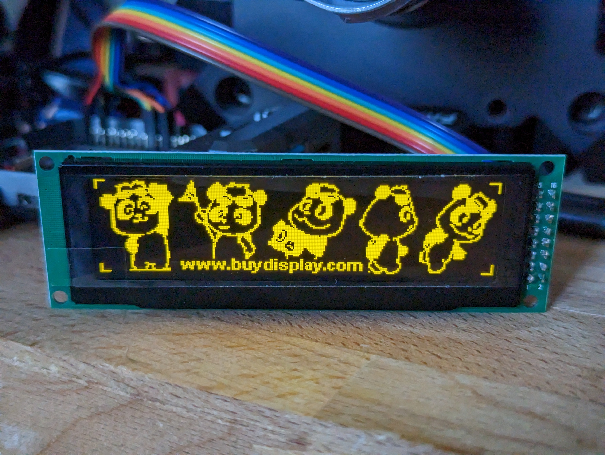
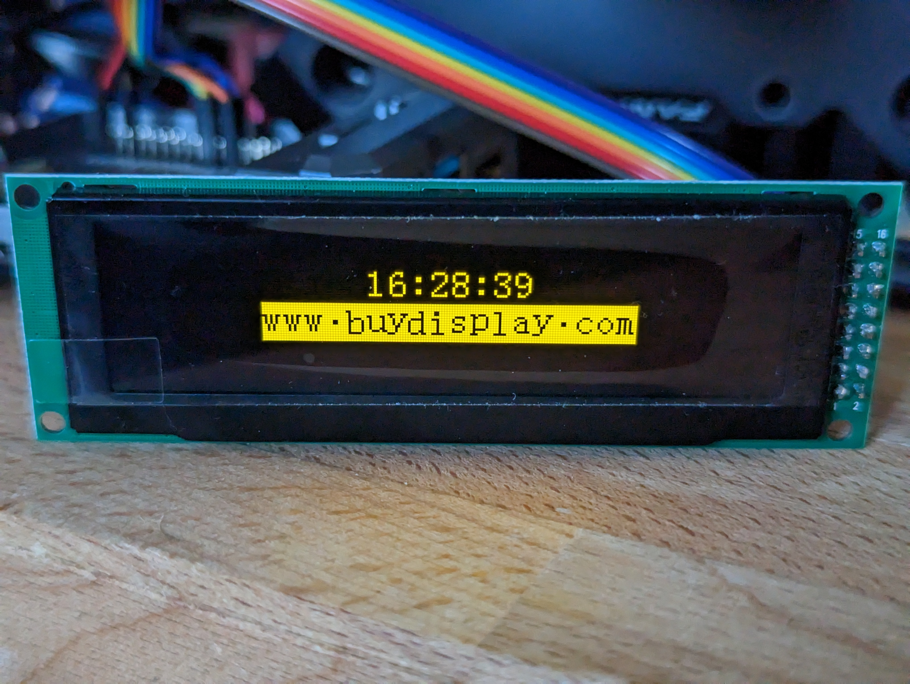

# OLED departure board <!-- omit in toc -->

## Contents <!-- omit in toc -->

- [Equipment](#equipment)
- [Testing the display](#testing-the-display)
  - [Install BCM2835 C library](#install-bcm2835-c-library)
  - [Test the OLED](#test-the-oled)
- [Running the departure board](#running-the-departure-board)
  - [Prerequisites](#prerequisites)
  - [Connecting the display](#connecting-the-display)
  - [Launch time!](#launch-time)
- [License](#license)

## Equipment

- Raspberry Pi 4
- [SD1322 256x64 SPI OLED display](https://www.buydisplay.com/yellow-3-2-inch-arduino-raspberry-pi-oled-display-module-256x64-spi)

## Testing the display

You can perform a basic sanity check on your SD1322 display before using it as a departure board.

### Install BCM2835 C library

The BCM2835 was used on the 1st gen Raspberry Pis but future models have maintained backwards compatibility in terms of GPIO access to the extent that the kernel developers have chosen to [report the BCM2835 as used in even modern Pis](https://forums.raspberrypi.com/viewtopic.php?t=245384).

We need to install a C library in order to access the GPIO pins and other features of the Pi within our application.

```
cd reference/bcm2835-1.71
./configure
make
sudo make check
sudo make install
```

These commands will build, test, and install the BCM2835 C library onto your Raspberry Pi.

### Test the OLED

If you're using the same OLED display as me, the seller provides a test program which you can use.

You'll need the BCM2835 library from the last step already installed.

```
cd reference/SPI_Interface
make
sudo ./oled
```

The test app should cycle through various monochrome bitmaps, before displaying the time and an cycling advert for "www.buydisplay.com".

<details>
<summary>Pictures of the test script running on the display.</summary>





</details>

## Running the departure board

### Prerequisites

On Ubuntu, you can run the following commands in a terminal to install the required prerequisites for your departure board

```
# Python and Luma prerequisites
sudo apt install install python3 python3-pip python3-pil libjpeg-dev zlib1g-dev libfreetype6-dev liblcms2-dev libopenjp2-7 libtiff5

# Enable non-root access to the SPI port for your current user
sudo usermod -a -G spi,gpio,i2c $(whoami)

# Install the Luma library and other dependencies
pip install -r requirements.txt
```

### Connecting the display

This may be different depending on your display, but this works correctly with mine.

> **Note**
>
> RPi pin numbers in the table below are the GPIO pin numbers and **not** the physical pin numbers on the header.

| Display pin | RPi GPIO pin |
| :---------: | :----------: |
|      1      |     GND      |
|      2      |    +3.3v     |
|      3      |  no connect  |
|      4      |     SCLK     |
|      5      |     MOSI     |
|      6      |  no connect  |
|      7      |  no connect  |
|      8      |  no connect  |
|      9      |  no connect  |
|     10      |  no connect  |
|     11      |  no connect  |
|     12      |  no connect  |
|     13      |  no connect  |
|     14      |   GPIO #24   |
|     15      |   GPIO #25   |
|     16      |     CE0      |

### Launch time!

Run the script!

```
# Replace GTW with any CRS codes
python src/main.py GTW
```

## License

This repository is licensed under the MIT license, but I do appreciate some form of attribution if you reuse this elsewhere.

The CustomPixelFont and CustomPixelFontSmall in `src/assets` were created by me using free (for now?) software called [PixelForge](https://www.pixel-forge.com/) ([download permalink](https://archive.org/details/pixel-forge-0.9b-windows-20221104)) developed by [Sergi Lázaro](https://www.sergilazaro.com/).

